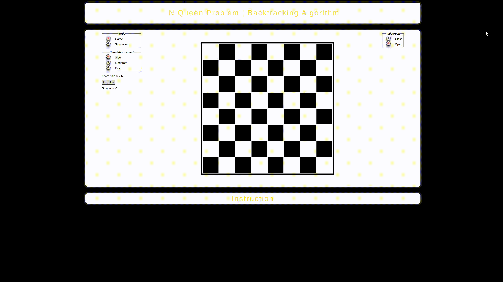

###################################################################
[ENG]

Algorithm overview: [link](https://www.youtube.com/watch?v=0DeznFqrgAI)

N Queen Problem has been formulated by Max Bezzel in 1848. The first solution was released and described two years later by Franz Nauck. Mathematician Carl Friedrich Gauss was interested in this topic as well. In 1992, the reletation between "N Queen Problem" and "magic square" was discovered.  

Project description:

Web App includes two different modes: game and simulation. Depending on the choice, player can discover solutions on his own or take advantage of the simulation. 
All results are presented beneath in a row. User can also change speed of the simulation and allow full screen mode.  

###################################################################
[PL]

Autor: Piotr Gapski

Wykorzystane technologie:
- HTML
- CSS
- JavaScript
- biblioteka jQuery

Test aplikacji:
- Google Chrome 
- Microsoft Edge 

Zaimplementowany algorytm:

https://www.youtube.com/watch?v=0DeznFqrgAI

Historia problemu: [Wikipedia]

Problem ośmiu hetmanów został po raz pierwszy sformułowany w 1848 roku przez mistrza szachowego Maksa Bezzela (1824-1871). Pierwsze rozwiązanie podał dwa lata później Franz Nauck. Również matematyk Carl Friedrich Gauss interesował się tym problemem. W roku 1992 wskazano na związki pomiędzy problemem ośmiu hetmanów a kwadratami magicznymi.

Opis projektu:

Aplikacja webowa zawiera dwa tryby: gra oraz symulacja. W zależności od wyboru
można skorzystać z symulacji, która przedstawia rozwiązanie problemu N-hetmanów 
stosując algorytm z nawrotami (ang. Backtracking algorithm). Zgodnie z algorytmem 
na planszy o wybranym wymiarze szachwnicy rozstawiani zostają hetmani według algorytmu. Algorytm po znalezieniu rozwiązania zapisuje rozwiązanie w postaci zapisu np. dla planszy 8x8 [xxxxxxxx], gdzie x - pozycja hetmana w kolumnie.
Podczas symulacji można wybrać jej prędkość, po znalezieniu rozwiazania algorytm zatrzymuje się na określony czas (2 sekundy), następnie poszukuje kolejnych rozwiązań. Po znalezieniu wszystkich rozwiązań zerowane są wszystkie zmienne.
Tryb gry umożliwia samodzielne rozstawienie hetmanów na planszy, niemożliwe jest ustawienie hetmana w pozycji kolizji (informuje o tym alert), po znalezieniu rozwiązania zapisywane zostaje rozwiązanie i wyświetlany jest alert informujący o pozostałych kombinacjach ustawienia hetmanów.
###################################################################
